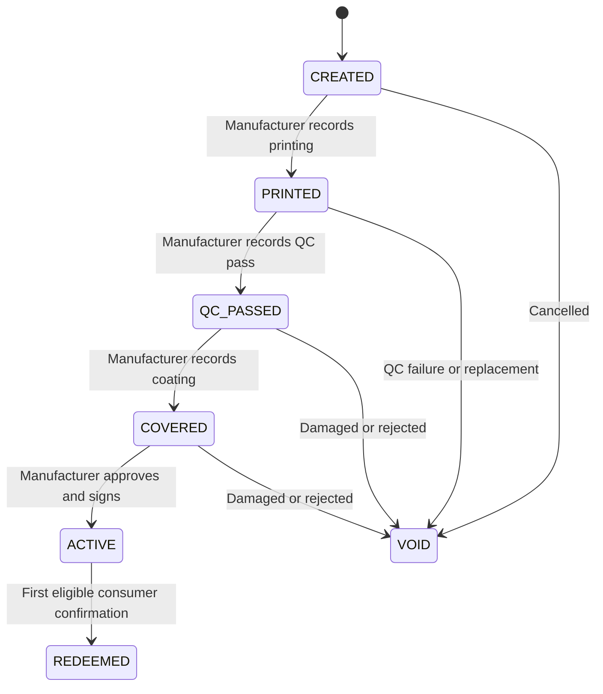

# Medicine Verification — Features and Implementation Plan

**Project:** Development and Effective Application of AI-Based, Post-Quantum Cryptography-Enabled Counterfeit Medicine Identification Tools for Better Treatment Outcomes in Bangladesh.

**Prepared:** 16 September 2026. **Current development scope:** Platform admin, manufacturer, and consumer ends, with a public landing page and shared backend. **Do not develop the printing/QC end or pharmacy end right now.** Physical printing, QC, and scratch coating remain operational steps; the manufacturer records their completion in its existing workspace.

The architecture and numerical targets below are proposed engineering decisions, not measured results or claims of research novelty. The linked primary sources support the cryptography and platform behavior.

## 1. How many ends should you build?

**Build three operational roles now: platform admin, manufacturer, and consumer.** Use one staff web portal, one consumer mobile app, one public landing page, and one shared backend. Printing/QC and pharmacy interfaces are deferred and are not dependencies for the first release.

| End / role | Interface | Required features | Build when |
| --- | --- | --- | --- |
| Platform admin | Staff web portal | Approve manufacturers; manage organization access; suspend accounts/keys; investigate reports; block units; view audit records | First version |
| Manufacturer | Same portal, manufacturer workspace | Maintain products/batches; generate serialized labels; record off-system printing/QC/coating completion; reconcile quantities; activate covered units; recall batches; investigate own products | First version |
| Printing / QC operator | No dedicated interface in the current release | Printing, readability checks, and coating happen outside the platform; manufacturer records completion | Deferred — do not develop now |
| Consumer | Flutter mobile app | Scan; retrieve and check signed information; explicitly confirm verification; see outcome/history; report concerns | First version |
| Pharmacy | No interface in the current release | Future scope may include external-reference lookup, recall information, and stock concerns | Deferred — do not develop now |
| General visitor | Public website | Installation instructions; store links when available; contact/help; no unit verification | First version |

Do not create factory/operator accounts, a factory scanner screen, pharmacy accounts, or pharmacy dashboards in this release. Authorized manufacturer staff record manufacturing completion and approve activation. If a factory end is added later, give its operators separate permissions without activation rights.

**Actual software projects:** `backend`, `staff-web`, and `consumer-app`. The landing page can be served by `staff-web`. A private signing component supports the backend; it has no user-facing end. Do not create a separate backend for each role.

**Unit decision:** For the pilot, one hidden code identifies one intact strip or package sold as a unit. If strips are cut and tablets sold separately, the original code does not authenticate each separated portion. Decide the physical unit before generating serials.

## 2. Implement the two QR experiences with one payload

### 2.1 What the QR actually contains

Use a short HTTPS URL with a random token in the fragment:

```text
https://anticounterfeitmed.com/#v=1&t=<43-character-base64url-token>
```

This is a proposed URL format using your supplied domain. Domain ownership, deployment, and app-store listings have not been verified.

Generate the token from **32 cryptographically random bytes**, encoded as unpadded Base64url. It is a possession credential, not an incrementing serial or a hash of predictable product data.

| Scanner / context | Behavior | Unit state changes? |
| --- | --- | --- |
| Normal camera or generic QR app | Opens the public website with installation/help content | No |
| Official app, inactive unit | Displays only “Not activated” and limited status | No |
| Official app, active unit | Fetches signed product information and current status from the protected API | No, while previewing |
| Official app, user taps “Verify this package” | Backend checks current eligibility and records the first successful verification | Yes: active → redeemed |
| Factory's existing camera/scanner, outside this platform | Performs the physical readability check; manufacturer staff later record the result | No automatic platform action; manufacturer confirmation updates readiness only |

**The printed QR does not change after activation.** Activation changes the backend record. The app parses the same URL that a normal camera sees; it does not read a second invisible QR payload.

The token is readable by anyone who can see the uncovered QR. App restriction must be enforced by the API, and cannot make a copied QR undecodable or stop someone using the genuine app with a copied token.

### 2.2 Public website behavior

The fragment keeps the token out of ordinary HTTP request paths, but browser scripts and the scanner can still read it. Treat it as sensitive.

- Serve the landing page directly at `/`; do not rely on a redirect to remove a token.
- At page startup, remove the fragment from browser history using `history.replaceState` without sending it anywhere.
- Do not run analytics, advertising, third-party scripts, or URL-capturing error reports on this page. Set a restrictive Content Security Policy and `Referrer-Policy: no-referrer`.
- Show instructions to open the official app and rescan. Add verified Play Store/App Store buttons when those listings exist. Store links contain no package token.
- Do not call verification or redemption APIs from this page. GET, HEAD, link previews, crawlers, and prefetches never change package state.

To preserve your exact camera → website requirement, **do not register the printed URL as an Android App Link or iOS Universal Link in the first version**. Universal Links can open an installed app directly; that would change the requested experience. Add a separate app-opening link later only if wanted, and test actual camera/browser behavior. See [Apple Universal Links](https://developer.apple.com/library/archive/documentation/General/Conceptual/AppSearch/UniversalLinks.html) and [Android App Link verification](https://developer.android.com/training/app-links/verify-applinks).

### 2.3 Enforce official-app access

For consumer API endpoints, require both:

1. A server-issued consumer session credential, stored in the device's protected credential storage. An anonymous installation session is enough for the pilot; phone-number registration is unnecessary.
2. A valid Firebase App Check token for the registered mobile app. Use Play Integrity on Android and App Attest on supported Apple devices. Verify tokens on the Django backend and allow only the intended mobile app IDs.

App Check supports custom backends and distinguishes app attestation from user authentication. It reduces abuse; it does not eliminate all abuse. See [App Check](https://firebase.google.com/docs/app-check) and [Python backend verification](https://firebase.google.com/docs/app-check/custom-resource-backend).

Create anonymous sessions only after validating app attestation. Use random opaque session tokens, store their hashes server-side, and support expiry/revocation. Reinstallation may create a new identity; it does not prove that a different person is scanning.

Also enforce server-side role checks, rate limits, single-use verification challenges, and idempotency. A header such as `X-Our-App: true`, an embedded API key, CORS, or a user-agent check is not authorization. Attestation failure produces “Unable to verify on this device”; production must not silently accept debug tokens. Use store test distribution for the pilot and separate development credentials.

## 3. Necessary features for each end

### 3.1 Platform admin

| Feature | Required behavior |
| --- | --- |
| Organization approval | Record manufacturer identity/contact and approved issuer-key association before allowing production issuance |
| Access control | Assign organization-scoped roles; require MFA for privileged staff; revoke access when staff leave |
| Investigation queue | Filter by code-not-found reports, repeated checks, blocked units, recall reports, and signing failures; assign cases and record findings |
| Emergency restriction | Suspend an organization or block a unit with a reason; suspension overrides a normal verification result |
| Audit viewer | Search actor, organization, package, action, timestamp, and request ID; export investigation evidence |
| Operational dashboard | Show failed print jobs, activation failures, API errors, unresolved reports, and counts of first/repeated verifications |

Admin should not edit signed product data, reset redeemed units to active, or routinely activate on behalf of a manufacturer. Investigations add a conclusion to the record; they do not erase history.

### 3.2 Manufacturer

| Feature | Required fields / behavior |
| --- | --- |
| Product catalog | Brand, generic name, strength, dosage form, unit/pack description, manufacturer, reference packaging image, and registration reference if available |
| Batch setup | Product, manufacturer batch number, manufacturing date, explicit expiry date, planned unit count |
| Serialization | Create unique unit IDs/tokens and a controlled label export; manufacturer downloads it for off-system printing; count issued units |
| Manufacturing readiness | Manufacturer staff record printed, QC-passed, rejected, coated, and voided unit lists from operational records; show activation-ready quantities |
| Activation | An authorized release manager approves only QC-passed, covered, unexpired units; create a signed activation credential before making each unit active |
| Recall / block | Recall a batch or block specific units with a reason, effective timestamp, and contact instructions |
| Results and reports | View own product verification totals, repeat events, and investigation cases; no access to unrelated manufacturers |

Freeze the product/batch snapshot used in a signed package credential. Editing the catalog later must not silently alter an issued credential. Before activation, correction requires an audited revision and reapproval; after activation, erroneous units are blocked and replaced through a controlled process.

Expiry must be unambiguous. If a source label provides only month/year, the manufacturer supplies the intended final valid date; the software must not guess the policy.

### 3.3 Printing and QC end — deferred, do not develop now

No dedicated factory portal, station login, scanner integration, or QC scan API is required in the current release. Keep this end in the future backlog without assigning a delivery milestone.

For now, use the manufacturer workspace for these minimum records:

1. Manufacturer staff export the generated QR labels and external human-readable unit references for printing outside the platform. External references cannot redeem units.
2. Printing personnel perform the physical readability checks using their existing equipment, then apply the scratch-off layer. Those scans do not call a platform QC endpoint or redeem codes.
3. Manufacturer staff select or upload the exact unit references and record completion of printing, QC, and coating, including the actual completion time and a source record/reference. Store the recording user's identity and entry time separately.
4. Record rejected units as void. Destroy or quarantine their labels, and generate new tokens for replacements.
5. The manufacturer's release manager activates only the units whose required completion records are present.

These are manufacturer-entered operational assertions, not automatically captured factory scan evidence. The system must label their source accordingly. The physical steps still occur; only the dedicated software end is deferred. Sample checks after coating and scratching, quantity reconciliation, and disposal of unused labels remain necessary operational controls.

### 3.4 Consumer mobile app

Build these screens:

| Screen | Necessary content |
| --- | --- |
| Scan | Camera, torch, framing guidance, Bangla/English switch, concise scratch-and-scan instructions |
| Package preview | Brand, generic, strength, dosage form, pack description, manufacturer, batch, manufacturing/expiry dates, reference image, current status |
| Verify action | “Verify this package”; explain that this records a check and does not record a sale |
| Result | Outcome, checked time, whether a first verification was recorded, and report/help action |
| History | This installation's own receipts, explicitly labeled with their original check times; refresh current status online |
| Report concern | Reason, optional packaging photo, optional pharmacy reference/contact, case number, and progress |

Do not request location to perform ordinary verification. Never show another consumer's identity or location. Without an internet connection, show “Connect to check current status”; an old signed receipt cannot establish today's recall or redemption status.

Use precise result text:

| Condition | Consumer result | Record a first redemption? |
| --- | --- | --- |
| Active, valid credential, eligible unit | “Code matches the manufacturer's record. First verification recorded.” | Yes, after confirmation |
| Inactive | “This code has not been activated by the manufacturer.” | No |
| Previously redeemed | “This code was previously verified. This additional check has been recorded.” | No; append a repeat event |
| Unknown token | “Code not found in this system.” | No |
| Expired | “The recorded expiry date has passed.” | No |
| Recalled | “This batch has been recalled. View the recall details.” | No |
| Blocked / suspended issuer | “Verification is restricted. Contact support.” | No |
| Invalid signature / untrusted key | “Unable to validate the manufacturer's record.” | No |
| Network or service unavailable | “Unable to complete verification. Please retry.” | No new commit unless the earlier request already committed |

Show this short clarification with a successful result: **“This checks the code's digital record; it does not test the medicine's contents.”** Never equate a first scan with “100% genuine,” “safe to consume,” or proof of sale.

### 3.5 Pharmacy end — deferred, do not develop now

Do not build pharmacy registration, roles, dashboards, stock lookup APIs, inventory, POS, or logistics integration in the current release. Pharmacy participation is not required for manufacturer activation or consumer verification. A consumer may still optionally enter a pharmacy name in a concern report; this does not require a pharmacy account or portal.

If this end is requested later, start with external unit-reference/batch lookup, recall details, and concern reporting. Pharmacy stock checks must not require scratching a customer's hidden QR. Any future `SALE_RECORDED` event must come from an explicit sale action; consumer verification must never create it.

## 4. State model and end-to-end behavior

### 4.1 Unit lifecycle



`REDEEMED` means **a first consumer verification was committed**, not that a purchase, medicine consumption, or delivery occurred. It is permanent. Subsequent checks add events without resetting the lifecycle.

Keep these restrictions separate from the lifecycle:

- Unit blocked/unblocked, with audited reasons.
- Batch recalled, with a published notice.
- Manufacturer suspended.
- Expiry calculated from the signed expiry date and server time.

A redeemed unit can subsequently be recalled; both facts must remain visible. Restriction messages take priority over a positive outcome, while retaining the previous verification history. The pilot does not automatically withdraw recalls.

### 4.2 Activation transaction

For each approved unit:

1. Require a manufacturer release role scoped to that unit's organization.
2. Confirm the batch is not recalled, the issuer is enabled, expiry has not passed, and manufacturer-entered printing/QC/coating completion records are complete. A factory portal or automated scan feed is not required.
3. Freeze the package snapshot and create the ML-DSA activation credential described in section 6.
4. Publish the credential and change `COVERED → ACTIVE` together after rechecking that the approved snapshot/version has not changed.
5. Record actor, approval ID, activated time, credential digest, and signing key ID.

Bulk activation is a tracked job with per-unit success/failure counts. Retry only failures. Never report the whole batch as active when some units failed signing or validation. A unit with no valid credential remains inactive.

### 4.3 Consumer preview and confirmation

1. The app decodes the URL locally and accepts only HTTPS, the exact expected host, the expected fragment version, and a valid 32-byte token. It never opens an arbitrary scanned URL automatically.
2. `POST /v1/consumer/verifications/prepare` receives the token, an app-generated random nonce, and the consumer session plus app-attestation credentials.
3. The backend hashes the token, retrieves the unit, checks the record, and returns the activation credential, a signed current-status response, and a short-lived challenge if a confirmation can be attempted. Inactive units expose only limited status.
4. The app verifies the trusted key, signatures, token commitment, request nonce, and response freshness before showing validated package information. The preview does not redeem.
5. The consumer taps “Verify this package.” The app sends `POST /v1/consumer/verifications/confirm` with the challenge, a fresh request nonce, and a stable idempotency key for this attempt.
6. The backend rechecks current restrictions and credential validity. It commits either the first redemption, a repeat-check event, or a declined attempt. It never trusts the app's claim that a signature passed.
7. Return a signed result tied to this request and the committed event. The app verifies it and stores the receipt locally.

**Starting policy:** challenges expire after 120 seconds and are bound to session, unit, intended action, and previewed credential version. Status/result envelopes expire after 120 seconds and carry the request nonce. These are pilot settings to test on slow connections, not properties of ML-DSA.

### 4.4 Concurrency, retries, and failures

Use PostgreSQL as the authority. In the confirmation transaction, enforce an idempotency record and lock the applicable organization/key, batch, and unit rows in a fixed order shared by restriction writers. This serializes confirmation against suspension, recall, and unit blocking as well as competing scans.

- Add a database unique constraint allowing at most one `FIRST_REDEMPTION` event per unit.
- Two different eligible confirmations arriving together produce one first redemption and one repeat outcome.
- The same session and idempotency key with the same request body return the existing operation; different bodies with that key receive a conflict.
- Consume the challenge in the same transaction as the event; an exact retry is resolved through the idempotency record before treating the challenge as spent.
- Reopening history or retrying a timed-out request does not create another scan event.
- If recall commits first, confirmation is declined; if confirmation commits first, the history retains that verification and subsequent reads show the recall.

Create a receipt-signing outbox entry in the same transaction as the event. If signing or response delivery fails after commit, do not undo redemption. The app displays a pending confirmation state and polls the operation endpoint; the worker signs the committed event. Recovery returns the same event with a fresh nonce-bound status envelope. Workers are idempotent.

The database records a server-side verification event, not proof that the consumer actually read the returned screen.

## 5. Minimum architecture, database, and API

### 5.1 Implementation stack

| Component | Choice | Responsibility |
| --- | --- | --- |
| API and business logic | Django + Django REST Framework | Roles, workflow, token lookup, transaction handling, reports |
| Database | PostgreSQL | Authoritative unit states, uniqueness, events, permissions |
| Staff portal + public page | React / Next.js | Role-scoped screens and public installation page |
| Consumer app | Flutter | Camera decoding, API client, local signature verification, receipts |
| Background jobs | Celery + Redis | Print generation, bulk activation orchestration, receipt outbox, report processing |
| Object storage | Private S3-compatible bucket | Short-lived print files, reference images, report attachments |
| Signing | Private service using maintained OpenSSL ML-DSA support | Manufacturer activation credentials and platform status/receipts |
| Deployment | Containerized API/worker/web, HTTPS reverse proxy, backed-up PostgreSQL | One pilot environment plus a separate development/staging environment |

Use one backend with internal modules: `organizations`, `catalog`, `serialization`, `qc`, `activation`, `verification`, `reports`, and `audit`. Redis is not the source of truth for redemption. No blockchain, Kafka, or service-per-role architecture is necessary here.

### 5.2 Required data entities

| Entity | Essential fields |
| --- | --- |
| Organization | ID, type, name, approval status, suspension state |
| StaffMembership | User, organization, role, enabled, MFA status |
| Product | Manufacturer, product fields, current reference image |
| Batch | Product, manufacturer batch number, manufacturing/expiry dates, recall status/notice |
| PrintJob | Manufacturer, batch, planned count, controlled label export, job status, reconciliation counts; no factory account dependency |
| PackageUnit | ID, external reference, batch/job IDs, unique token hash, lifecycle, blocked reason, version, activated/redeemed timestamps |
| Manufacturing completion event | Step: printed/QC/coated; unit or explicit unit-list reference; recording manufacturer user; actual completion time; entry time; result; source record/reference; reason |
| ActivationCredential | Unit, exact signed bytes, signature, key ID, algorithm, snapshot version, activation approval |
| ConsumerSession | Installation/session ID, hashed credential, expiry, revoked state |
| VerificationChallenge | Unit, session, credential version, expires time, consumed time |
| VerificationOperation | Session + idempotency key, request digest, unit, outcome, event ID, receipt readiness |
| VerificationEvent | Unit, event type, session reference, server time, previous event reference where needed |
| SignedReceipt / Outbox | Event, signed bytes/signature or pending job, retry status |
| SigningKey | Key ID, organization/purpose, public key, validity, revoked/retired status, private-key reference only |
| Report / AuditEvent | Case or action, actor, unit/batch reference, reason, timestamps, attachment references, review outcome |

Store `SHA-256(raw_token)` as the database lookup value. Keep raw tokens only in the controlled print-generation path and transient request memory. Do not place them in audit events, reports, analytics, support screenshots, or ordinary application logs.

Keep encrypted print artifacts until the job is reconciled, then delete them within 24 hours; record deletion metadata. A reprint after reconciliation requires voiding/replacing the affected unit. Review printer spool retention too: hashing the database does not remove copies already held by the factory.

### 5.3 Minimum endpoints

All paths below are proposed API contracts. Organization and object-level authorization is mandatory on every staff endpoint.

| Method and path | Caller | Behavior |
| --- | --- | --- |
| `GET /` | Public | Landing/help page only |
| `POST /v1/consumer/sessions` | Attested app | Create anonymous consumer session |
| `GET /v1/trust/manifest` | App | Root-signed issuer/service public-key manifest |
| `POST /v1/products` | Manufacturer | Create product |
| `POST /v1/batches` | Manufacturer | Create batch |
| `POST /v1/print-jobs` | Manufacturer | Generate serials/tokens and controlled label export for off-system printing |
| `POST /v1/manufacturing-confirmations` | Authorized manufacturer staff | Record printed/QC/coated results for exact unit lists, with completion time and source reference |
| `POST /v1/activation-jobs` | Manufacturer release manager | Approve/sign/activate eligible units |
| `GET /v1/activation-jobs/{id}` | Authorized manufacturer | Per-unit results and failure counts |
| `POST /v1/consumer/verifications/prepare` | Attested consumer session | Fetch signed information/status; issue challenge |
| `POST /v1/consumer/verifications/confirm` | Attested consumer session | Commit first or repeat check idempotently |
| `POST /v1/consumer/operations/{id}/status` | Owning attested session | Recover result with fresh request nonce; no new check |
| `POST /v1/consumer/packages/status` | Attested consumer session | Refresh a known package using its token or owned receipt; no redemption |
| `POST /v1/reports` | Consumer or scoped staff | Create a concern report; accept external references when token unavailable |
| `GET /v1/reports/{id}` | Reporter or assigned reviewer | Read permitted case fields |
| `POST /v1/batches/{id}/recall` | Manufacturer release manager | Publish recall and prevent later first redemptions |
| `POST /v1/units/{id}/block` | Authorized manufacturer/admin | Restrict unit with audited reason |

**Deferred APIs:** Do not implement factory station, automated QC scan, or pharmacy lookup endpoints in this release. The manufacturer confirmation endpoint is sufficient for recording off-system manufacturing readiness.

Add the corresponding scoped listing/detail and account-management routes required by the screens. Consumer endpoints never accept staff sessions as a substitute for app attestation, and staff endpoints never accept a consumer credential as authority.

## 6. Where PQC belongs

**Use ML-DSA for signatures and ML-KEM for establishing encryption keys.** ML-KEM does not sign records or directly encrypt arbitrary QR/product content. Use standardized algorithm names and implementations: ML-DSA and ML-KEM are standardized successors derived from Dilithium and Kyber; do not assume old implementations produce interchangeable artifacts. See [NIST FIPS 204](https://csrc.nist.gov/pubs/fips/204/final) and [NIST FIPS 203](https://csrc.nist.gov/pubs/fips/203/final).

### 6.1 Placement and priority

| Location | Algorithm / mechanism | What it protects | Implementation priority |
| --- | --- | --- | --- |
| Manufacturer activates a unit | ML-DSA-65 signature on the activation credential | Origin/integrity of the manufacturer-associated product and activation record | Core PQC pilot |
| Backend returns status/verification receipt | ML-DSA-65 signature with nonce, time, status and event binding | Detects altered or replayed application responses when verified correctly | Core PQC pilot |
| App receives issuer and service keys | Root-signed ML-DSA trust manifest | Prevents accepting an attacker's substituted public key | Required with signatures |
| Controlled client → API transport | TLS 1.3 hybrid key exchange, e.g. `X25519MLKEM768` | Adds PQ protection to session-key establishment where negotiated | Next phase |
| Long-term audit exports | Signed checkpoint/export | Allows later checking of exported evidence | Add when evidence exports are used |
| QR printing, scratch coating, database redemption | Random tokens, physical controls, permissions, transactions | These functions are not performed by PQC | Required independently |

ML-DSA-65 is a proposed initial parameter choice, not a statement that every deployment requires it. Benchmark ML-DSA-44 and ML-DSA-65 before fixing a production policy. ML-DSA-65 signatures are 3,309 bytes, so storing signatures in the API response keeps the printed QR much smaller. Larger QR payloads require denser/larger symbols. See [FIPS 204, Table 2](https://nvlpubs.nist.gov/nistpubs/FIPS/NIST.FIPS.204.pdf) and [DENSO QR capacity guidance](https://www.qrcode.com/en/about/version.html).

### 6.2 Manufacturer activation credential

At activation, sign this immutable record for each unit:

```json
{
  "schema": "medicine-activation-v1",
  "algorithm": "ML-DSA-65",
  "key_id": "manufacturer-key-identifier",
  "manufacturer_id": "manufacturer-identifier",
  "package_id": "unit-identifier",
  "token_sha256": "hex-digest-of-the-raw-token",
  "product_snapshot": {
    "brand": "manufacturer-supplied-value",
    "generic": "manufacturer-supplied-value",
    "strength": "manufacturer-supplied-value",
    "dosage_form": "manufacturer-supplied-value",
    "pack_description": "manufacturer-supplied-value"
  },
  "batch_number": "manufacturer-batch-number",
  "manufactured_on": "YYYY-MM-DD",
  "expires_on": "YYYY-MM-DD",
  "qc_event_id": "qc-event-identifier",
  "coating_event_id": "coating-event-identifier",
  "activation_approval_id": "approval-identifier",
  "activated_at": "UTC-timestamp",
  "record_version": 1
}
```

This is a schema illustration, not a signed test vector. Add any displayed manufacturer identity/registration fields to the signed snapshot. If the reference image is presented as authenticated, include its digest; otherwise label it as illustrative.

Encode with JSON Canonicalization Scheme, sign the canonical bytes, and transmit those same bytes plus a detached signature. The verifier checks the signature on the received bytes before parsing/displaying them. Reject duplicate JSON keys and invalid schema types. Use explicit ML-DSA context strings such as `medicine-activation-v1` and `medicine-status-v1` to separate uses. See [RFC 8785](https://www.rfc-editor.org/rfc/rfc8785).

On the app and backend, verify that the signed token commitment matches the scanned token, that the key is authorized for this manufacturer, and that the credential belongs to the requested unit. A valid signature on some other package must fail this binding check.

### 6.3 Dynamic status and result signatures

Keep current status outside the static activation credential. A static signature cannot know that a later scan, block, or recall occurred.

Sign a separate response containing: schema, key ID, package ID/token commitment, activation-credential digest, lifecycle, applicable restrictions, outcome, operation/event ID where applicable, request nonce, server issue time, and expiry time.

The app validates its expected nonce, permitted response age, key purpose, package binding, and signature. Stored receipts are historical evidence; refreshing status is still required. A valid signature authenticates the signing service's statement, not the correctness of every database operation behind it.

### 6.4 Key custody and trust

- Use separate keys for each manufacturer's activation credentials and for the platform's status/receipt service.
- Keep private keys out of the mobile app, QR, JavaScript bundle, ordinary database rows, and source repository.
- The app ships with an offline root public key. Root-signed, versioned manifests authorize manufacturer and service keys with purpose, validity and revocation status.
- Require a fresh manifest for online verification; a starting cache limit is 24 hours, with immediate refresh on unknown/revoked-key errors. Prevent rollback to a manifest version already superseded on that installation.
- Retired keys can remain valid for historical credentials according to policy. Compromised/revoked keys trigger a verification hold for affected credentials and human review; do not silently trust old signatures.
- In the pilot, an isolated signing service may hold encrypted per-manufacturer keys with restricted process access. If the platform controls those keys, describe the result as a **platform-managed manufacturer-associated signature**, not independent proof that only the manufacturer could sign.
- Manufacturer-operated signing infrastructure is necessary if independent manufacturer custody becomes a requirement. Do not assume an existing HSM/KMS supports ML-DSA without checking that exact product.

Key-manifest freshness limits detection of revocation; it does not make revocation instantaneous. A compromised offline root requires a separately authenticated app/trust update. Protect and back up signing keys, and verify recovery before issuance.

### 6.5 Library and transport implementation

Use maintained OpenSSL 3.5-series or newer supported builds exposing ML-DSA through EVP. For Flutter, build a narrow native verification wrapper through Dart FFI and test Android ARM64 and iOS ARM64 explicitly; Dart's normal TLS client does not automatically gain PQC because a server uses OpenSSL. Confirm Python binding support during the initial spike; if unavailable, keep signing behind the private native service. See [OpenSSL ML-DSA API](https://docs.openssl.org/3.5/man7/EVP_SIGNATURE-ML-DSA/).

`liboqs` can support research experiments and comparison tests, but its maintainers explicitly caution against relying on it in production or for sensitive data. Do not make it the unreviewed production dependency. See [liboqs security guidance](https://github.com/open-quantum-safe/liboqs#limitations-and-security).

For ML-KEM, first test one controlled service/client connection using the library's implemented TLS 1.3 hybrid group, such as `X25519MLKEM768`. Record the actual negotiated group, handshake latency, and bytes. Later extend to mobile only after its transport stack supports it. The TLS endpoint terminates protection; upstream connections need their own protection. See [OpenSSL TLS group support](https://docs.openssl.org/3.5/man3/SSL_CTX_set1_curves/).

Use the library's protocol implementation; do not design a custom Kyber handshake or add static keys to the QR. Hybrid key exchange does not itself replace classical TLS certificates or app-attestation dependencies. Label connections that fall back to classical TLS accordingly, and make PQC-specific experiments fail rather than silently fall back. The first release should claim **PQC-signed verification records**, not that the entire system is fully post-quantum secure.

## 7. Repeated scans and the actual security boundary

Apply deterministic rules first:

| Event | Treatment |
| --- | --- |
| Retry with the same idempotency key | Same operation; no new scan count |
| User reopens their saved receipt | History view; no new verification event |
| New confirmation for a redeemed unit | Record repeat event; display prior-verification warning; flag for assessment |
| Same installation makes a repeat check | Low-priority repeat; identity remains only an installation/session signal |
| Distinct installations confirm the same unit | Higher-priority review; still not automatic proof of counterfeiting |
| Consumer attempts a preactivation check | Record limited security telemetry; surface to manufacturer if repeated |
| Invalid/untrusted activation credential | Decline redemption; open technical/security investigation |
| Unknown-token bursts | Apply rate limits and investigate abuse without changing unrelated units |

Starting rate limits: 30 prepare requests/minute per session and 10 confirm requests/minute per session, with broader IP controls tuned for shared pharmacy/mobile networks. Rate-limit failures are not counterfeit labels.

The unresolved attack is **copying before first redemption**: someone who reads the QR at the factory or after scratching can put a copy on another package and redeem first. The first response alone cannot tell which physical package is genuine. Physical controls, label reconciliation, scratch integrity, supply-chain evidence and investigation address that risk; ML-DSA does not remove it.

The pilot trusts approved manufacturers' submitted product information and their recorded off-system QC/coating assertions. It does not claim direct automated evidence from a factory scanner. A malicious authorized issuer can sign false data, and a compromised signing service can sign false responses. Record these limits in project claims and reports.

## 8. Where AI can be added without inventing an authenticity claim

The first operational version does not need an AI model. It needs reliable serialization, state transitions and signed verification. Collect optional, consented packaging images through concern reports to support a later experiment.

The first useful AI feature is **packaging-text mismatch assistance**:

1. Ask the consumer to photograph the printed batch/expiry area only when investigating a concern.
2. Run OCR to extract batch number, expiry, brand/strength where visible.
3. Compare extracted text with the signed record.
4. Show “Printed information may not match the record” or “Image unclear,” with human review. Never let OCR mark a medicine genuine or alter redemption.

Before deploying this feature, manually label a pilot set of at least 300 packaging images from at least 10 batches, including clear, blurred, reflective and mismatched examples. These are proposed minimum pilot numbers, not sufficient evidence for a broad medical-authenticity model. Obtain manufacturer/physical-document ground truth, split by batch, and measure field extraction accuracy, mismatch recall, false alerts, and failure-to-read rate against manual review. Synthetic mismatches must be labeled separately from confirmed counterfeit examples.

Keep deterministic repeat-scan rules as the baseline. An anomaly model can be evaluated only after investigation outcomes provide labels; scan repetition alone is not a counterfeit label.

## 9. Implementation milestones

Build in this order. Do not advance past a gate with an unresolved failure in the verification path.

| Milestone | Concrete work | Completion gate |
| --- | --- | --- |
| 1. Freeze protocol and run technical spikes | Agree unit size, token URL, lifecycle, role permissions and record schema; test QR fragments on real cameras; sign on server and verify on one Android device | Same signed bytes verify across server/mobile; invalid bytes fail; printed URL opens correct website |
| 2. Backend foundation | Organizations, MFA staff access, product/batch tables, object permissions, unit constraints, audit events | Manufacturer A cannot access/activate manufacturer B's units |
| 3. Manufacturer readiness records | Generate/export labels; record off-system printing/QC/coating completion; reject/replace codes; reconcile quantities | Manufacturer can record required evidence and activate eligible units without a factory end |
| 4. Activation and trust | Private signing component, signed credentials, trust manifest, issuer binding, per-unit bulk job results | Tampered data, wrong keys, and failed signing never produce active eligible units |
| 5. Consumer flow | Flutter scan/preview/confirm/result/history/report; anonymous sessions; app attestation; signed statuses and receipts | Browser visits do nothing to unit state; genuine app completes one valid verification |
| 6. Failure handling | Transactions, concurrent requests, outbox, retries, pending receipts, recall and suspension checks | One first redemption under contention; retry and signer-failure recovery preserve the same event |
| 7. Physical and operational pilot | Print/scratch tests, representative phones, API load measurements, alert/case review, backup restoration | Acceptance tests below pass; issues and measured results are recorded |
| 8. Further PQC / AI experiments, later | Hybrid TLS measurements; then labeled OCR mismatch experiment | Negotiated algorithms are evidenced; AI performance is evaluated against ground truth |

**Deferred backlog, outside the current milestones:** Printing/QC end and pharmacy end. Develop either only when it is brought into scope in a later phase. Neither is a first-release dependency.

**Planning estimate:** 10–14 full-time development weeks for one experienced developer to reach a controlled Android pilot through milestone 7, assuming prompt manufacturer input and access to cryptography review. This is an estimate, not a delivery guarantee. Packaging trials, native cryptography integration, signing-key operations and store distribution can change it. iOS shares Flutter UI code but needs its own native verification, attestation and device tests before release.

For the first three working days, implement only the URL/camera experiment, the activation-credential sign/verify spike, and a PostgreSQL test proving exactly one redemption under simultaneous requests. These resolve the biggest architectural risks before building dashboards.

## 10. Acceptance tests and pilot measurements

### 10.1 Mandatory correctness tests

| Test | Pass condition |
| --- | --- |
| Public URL safety | Camera opening, GET/HEAD, prefetch and reload cause zero redemption events |
| App-only API controls | Missing/invalid app attestation or consumer session cannot retrieve protected details or confirm |
| Role isolation | Unrelated manufacturers and public callers cannot activate/redeem; factory/pharmacy roles and endpoints are not exposed |
| Lifecycle | Manufacturer-recorded printing/QC/coating prerequisites enforced; voided or redeemed units cannot be reset through normal APIs |
| QR binding | A valid credential from another unit fails when paired with this token |
| Signature checks | Modified payload, wrong issuer, unknown/revoked key, wrong context and truncated signature fail |
| Freshness | Old nonce, stale signed response, expired challenge and manifest rollback are rejected |
| Race test | 100 different concurrent eligible attempts yield exactly one first-redemption event; other confirmations are classified correctly |
| Retry test | 100 retries of one operation do not inflate first or repeat counts |
| Post-commit failure | Drop connection or stop signer after commit; recovery returns the same event with no rollback or duplicate |
| Recall race | Concurrent recall/confirmation follows transaction ordering; subsequent status always exposes recall |
| Privacy | Logs and reports do not contain raw QR/session tokens; users cannot read another session's history |
| Restore | Restore a backup in isolation and verify that known redeemed units stay redeemed and signed records still verify |

Database recovery must not reopen spent codes. Enable PostgreSQL continuous WAL archiving/point-in-time recovery plus encrypted daily backups; verify restoration. If acknowledged events cannot be recovered after an incident, hold verification for affected units until reconciled instead of treating them as unredeemed.

### 10.2 Physical QR test

These are manual packaging/consumer-scanning tests, not a requirement to develop a printing/QC interface. Start by comparing **20 mm and 25 mm** total label footprints, subject to actual strip space, with **M and Q** error correction. Include the required clear border in the footprint. Do not add a logo inside the QR.

Print 20 distinct labels for each size/error-correction combination on the actual packaging material: 80 labels total. Check decoding before coating. Apply the real scratch layer, scratch it normally, then test those labels using three representative phones in three documented conditions: normal indoor light, low light, and reflective/angled presentation. This produces 720 post-scratch trials. Repeat on each additional packaging material used in the pilot.

Record success/failure, time to decode, phone, material, size, error correction, and lighting. A starting release gate is at least 95% decoding within three seconds in each supported ordinary-use condition; if the real packaging fails, improve printing/size/coating and retest before rollout. This is a project target, not a universal QR performance guarantee. DENSO explains the relationship between payload, version and error correction in its [QR guidance](https://www.qrcode.com/en/about/version.html).

### 10.3 Performance and research measurements

Use 10,000 synthetic units and isolated test keys for load/cryptography experiments. Exclude synthetic events from production dashboards and fraud labels.

Measure separately: QR decode time, activation signing throughput, app signature-verification time, prepare/confirm latency, receipt-signing delay, response bytes, first/repeat outcome accuracy, and attestation-related failures. Report p50/p95 with phone models, server configuration, library versions, network conditions and test scripts.

A useful starting service target is p95 under two seconds from confirmation tap to a verified receipt at 20 confirmation requests/second, under a documented test network. Measure it; do not promise it before testing. Keep QR decoding outside that timing and report it separately.

For PQC comparison, run the same canonical record and workflow with a classical signature baseline and ML-DSA-44/65. Compare byte overhead and end-to-end latency, not just cryptographic microbenchmarks. These experiments can support research, but implementing standard algorithms in this workflow alone does not establish novelty.

## 11. What the first delivered version includes

- One staff portal with admin and manufacturer workspaces, including manufacturer-entered manufacturing completion records.
- One Android consumer app, with Bangla/English text, signed previews/results, confirmation, history and reports.
- One public installation page at the supplied domain once domain access/deployment is available.
- One shared backend with an auditable, concurrency-safe lifecycle and recoverable verification events.
- ML-DSA-signed activation credentials, status responses, receipts, and a trusted public-key manifest.
- Real printed-label testing and documented negative/failure tests.

**Printing/QC and pharmacy ends are not required to be developed right now.** Their interfaces, accounts, scanner/stock integrations, and dedicated APIs are deferred. The current release has three operational ends: admin, manufacturer, and consumer. iOS release, hybrid ML-KEM transport, and OCR assistance remain later extensions. No sale/consumption inference, offline first redemption, QR-embedded PQC signatures, full pharmacy ERP, or automatic physical-authenticity verdict is part of this first version.
