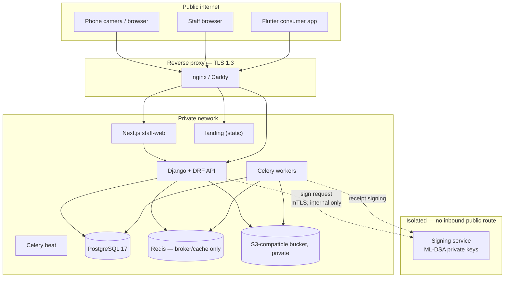

# 02 — Architecture

Source: SRS §5.1. Deviations marked.

## Repository layout (monorepo)

One repository, four deployables plus shared crypto fixtures.

```text
anticounterfeitmed/
├── backend/            Django + DRF. The only writer to PostgreSQL.
│   └── apps/
│       ├── organizations/   Orgs, staff memberships, roles, MFA, suspension
│       ├── catalog/         Products, batches, reference images
│       ├── serialization/   Token generation, print jobs, label export
│       ├── qc/              Manufacturer-asserted printing/QC/coating records
│       ├── activation/      Approval, signing orchestration, activation jobs
│       ├── verification/    prepare / confirm / status, challenges, events
│       ├── trust/           Signing keys, root-signed trust manifest
│       ├── reports/         Concern reports, investigation cases
│       └── audit/           Append-only audit events
├── signer/             Isolated signing service. Holds private keys. No DB access.
├── staff-web/          Next.js. Admin + manufacturer workspaces.
├── landing/            Static public page. No framework, no JS deps.  [DEVIATION]
├── consumer-app/       Flutter. Android first.
├── crypto-vectors/     Golden test vectors shared by backend, signer, and Flutter.
├── infra/              Compose files, deployment config, backup scripts.
└── docs/               These documents.
```

**One backend, not one per role.** The SRS is explicit. Roles are enforced by permissions inside a single Django project, not by separate services.

## Service topology



### Why the signer is a separate process

Not ceremony — it is the one boundary that limits blast radius. It:

- holds ML-DSA private keys and **nothing else**;
- has **no database credentials** and no S3 access;
- exposes exactly one narrow internal operation: `sign(key_id, context, canonical_bytes) -> signature`;
- **never** builds the bytes it signs and never parses them semantically — the caller supplies finished canonical bytes;
- has no public route; reachable only from `api` and `worker` over mTLS on the private network.

A compromised Django process can request signatures (bad, and audited) but cannot exfiltrate a key. That is the whole point.

Corollary the SRS insists on (§6.4): because the platform controls manufacturer keys in the pilot, the honest description is a **platform-managed manufacturer-associated signature** — not independent proof that only the manufacturer could sign.

## Redis is not the source of truth

PostgreSQL is the sole authority for unit state, redemption uniqueness, and events. Redis is a Celery broker and a cache. **Never** gate a redemption on a Redis value. If Redis is wiped, no verification outcome may change.

## Module boundary rules

1. Only `verification` writes `VerificationEvent`. Only `activation` writes `ActivationCredential`.
2. Nothing outside `serialization` ever sees a raw token except the confirm/prepare request handler, in memory, for the duration of the request.
3. Every state transition writes an `AuditEvent` in the same transaction as the change.
4. Cross-app calls go through a service function, not by reaching into another app's ORM models.

## DEVIATION — the landing page is its own static deployable

**SRS §5.1 says the landing page can be served by `staff-web`.** I recommend against it.

**Rationale.** SRS §2.2 requires the landing page to have no analytics, no third-party scripts, no URL-capturing error reporting, a restrictive CSP, and `Referrer-Policy: no-referrer` — because the QR token sits in the URL fragment and is readable by any script on the page. A Next.js app carries a hydration runtime, a framework error overlay/reporter, and a dependency tree that any future `npm install` can extend. A single well-meaning addition of an error reporter or analytics snippet to the staff portal would silently start exfiltrating package tokens.

`landing/` is therefore a handful of static files with **zero JavaScript dependencies** and one small inline script whose only job is `history.replaceState` to strip the fragment. It can be served by the same nginx/Caddy from a separate root, so this costs nothing operationally.

**Cost of the deviation:** landing page styling is maintained separately from the portal's design system. That is acceptable for a page that shows install instructions.

If the owner prefers to follow the SRS literally, the mitigation is a hard CI check that the landing route's bundle contains no third-party origins and no analytics — which is more fragile than just keeping it static.

## Deployment shape

Containerized: `api`, `worker`, `beat`, `web`, `signer`, `postgres`, `redis`, `proxy`. Two environments minimum — pilot and a separate development/staging — per SRS §5.1. See doc 12.
