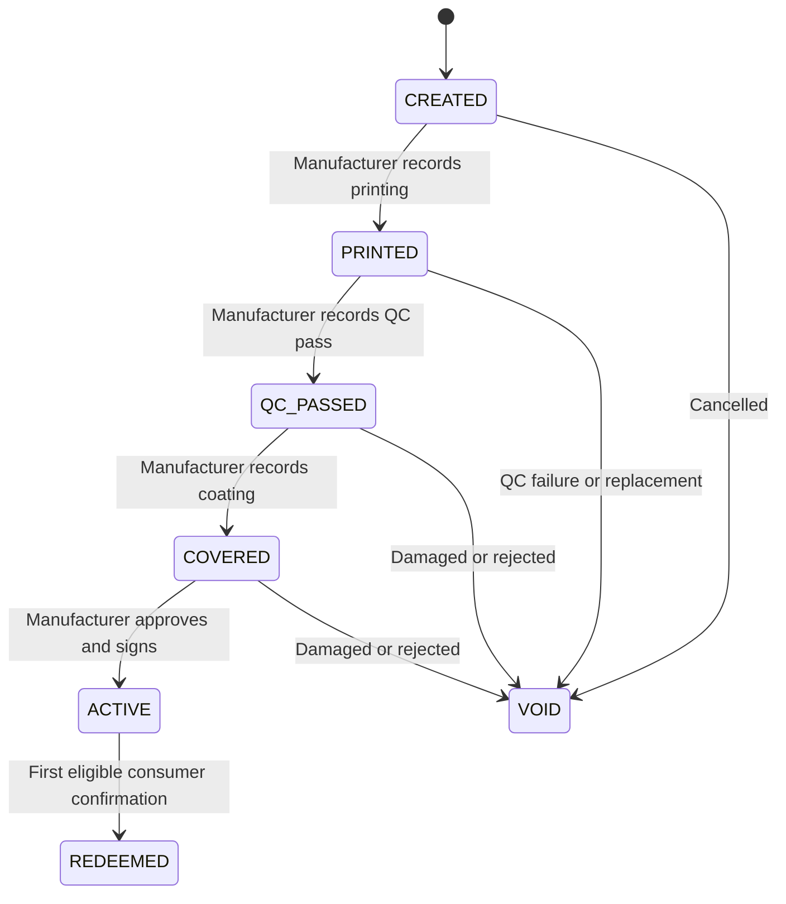

# 04 — Domain Model

Source: SRS §4.1, §5.2.

## Unit lifecycle



`REDEEMED` means **a first consumer verification was committed** — not a purchase, not consumption, not delivery. It is **permanent**. Later checks append events without resetting the lifecycle.

### Restrictions are NOT lifecycle states

Keep these as separate, independently-settable fields. A unit can be both `REDEEMED` and recalled, and **both facts must stay visible**.

| Restriction | Scope | Set by |
| --- | --- | --- |
| Unit blocked / unblocked | Unit | Manufacturer or admin, audited reason |
| Batch recalled | Batch | Manufacturer release manager, with published notice |
| Organization suspended | Org | Platform admin |
| Expired | Derived | Signed expiry date vs. server time — not stored state |

**Restriction messages take priority over a positive outcome**, while retaining previous verification history. The pilot does not automatically withdraw recalls.

## Entities

| Entity | Essential fields |
| --- | --- |
| `Organization` | id, type, name, approval status, suspension state |
| `StaffMembership` | user, organization, role, enabled, MFA status |
| `Product` | manufacturer, brand, generic, strength, dosage form, pack description, registration ref, current reference image |
| `Batch` | product, manufacturer batch number, manufacturing date, expiry date, recall status, recall notice |
| `PrintJob` | manufacturer, batch, planned count, controlled label export ref, status, reconciliation counts |
| `PackageUnit` | id, external reference, batch, print job, **token hash**, lifecycle, blocked reason, version, activated_at, redeemed_at |
| `ManufacturingCompletionEvent` | step (printed/qc/coated), unit or unit-list ref, recording user, **actual completion time**, **entry time**, result, source record reference, reason |
| `ActivationCredential` | unit, exact signed bytes, signature, key id, algorithm, snapshot version, activation approval |
| `ConsumerSession` | installation/session id, hashed credential, expiry, revoked |
| `VerificationChallenge` | unit, session, credential version, expires_at, consumed_at |
| `VerificationOperation` | session + idempotency key, request digest, unit, outcome, event id, receipt readiness |
| `VerificationEvent` | unit, event type, session ref, server time, previous event ref |
| `SignedReceipt` / `Outbox` | event, signed bytes + signature or pending job, retry status |
| `SigningKey` | key id, organization/purpose, public key, validity, revoked/retired, private-key **reference only** |
| `Report` / `AuditEvent` | case/action, actor, unit/batch ref, reason, timestamps, attachment refs, review outcome |

## Token storage — the rule that must never bend

Store **`SHA-256(raw_token)`** as the lookup value (`bytea`, unique index). Raw tokens exist **only** in:

1. the controlled print-generation path, and
2. transient request memory during prepare/confirm.

Raw tokens must **never** appear in audit events, reports, analytics, support screenshots, error traces, or ordinary application logs. See doc 07.

Token generation: **32 cryptographically random bytes**, unpadded Base64url (43 chars). It is a possession credential — never an incrementing serial, never a hash of predictable product data.

## Database invariants (enforce in PostgreSQL, not only in Python)

```sql
-- Exactly one first redemption per unit, ever.
CREATE UNIQUE INDEX one_first_redemption_per_unit
    ON verification_event (unit_id)
    WHERE event_type = 'FIRST_REDEMPTION';

-- Token lookup is unique.
CREATE UNIQUE INDEX uniq_token_hash ON package_unit (token_hash);

-- One operation per (session, idempotency key).
CREATE UNIQUE INDEX uniq_idempotency
    ON verification_operation (session_id, idempotency_key);
```

Application-level checks are a usability nicety. **The partial unique index is what actually guarantees correctness under concurrency** (SRS §10.1 race test: 100 concurrent attempts → exactly one first redemption).

Additional constraints:

- A `CHECK` constraint restricting lifecycle transitions, or a trigger rejecting `REDEEMED → ACTIVE` and any transition out of `VOID`.
- `expires_on` NOT NULL on `Batch`.
- Audit events append-only: revoke `UPDATE`/`DELETE` from the application role.

## Snapshot immutability

The product/batch snapshot inside a signed activation credential is **frozen**. Editing the catalog later must not silently alter an issued credential.

- Before activation: correction requires an audited revision and re-approval.
- After activation: erroneous units are **blocked and replaced** through a controlled process — never edited.

`PackageUnit.version` / `snapshot version` exists so a challenge can be bound to the exact credential version previewed.

## Expiry must be unambiguous

If a source label gives only month/year, **the manufacturer supplies the intended final valid date**. The software must not guess the policy. Store a full date; reject a batch without one.
